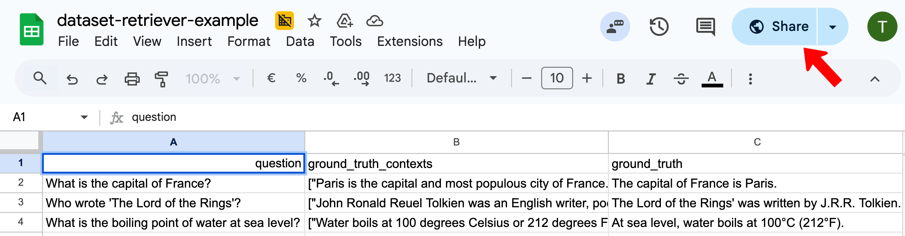
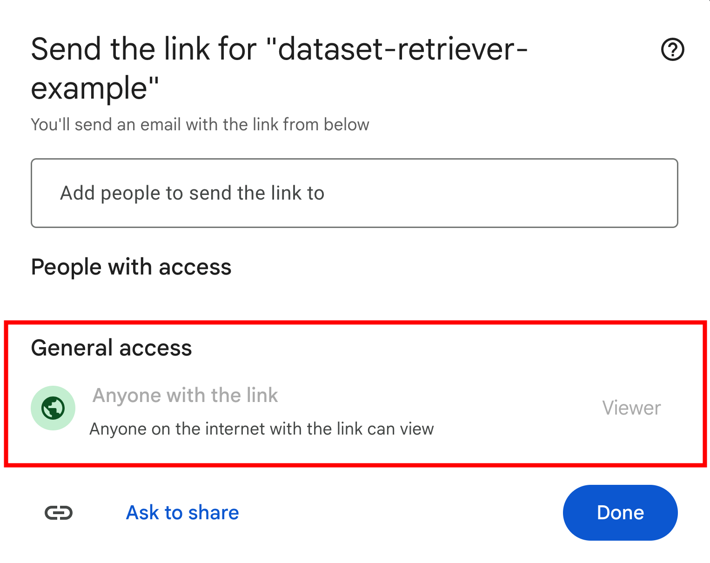
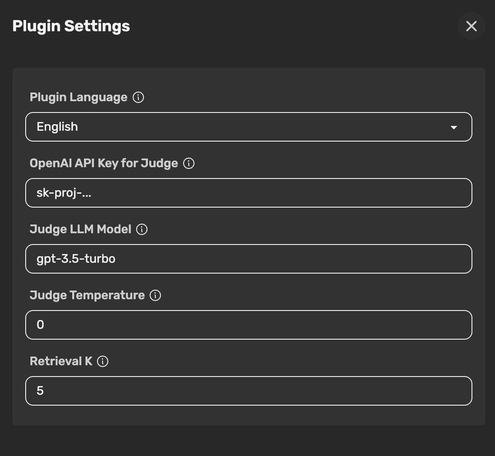
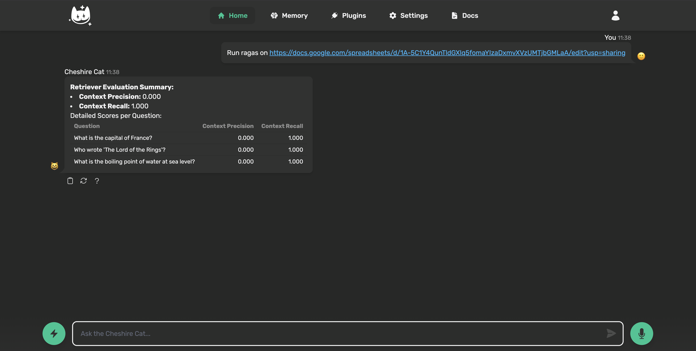

# Ragas Retriever & Generator Evaluator Plugin

This plugin provides tools to evaluate both the **retriever** and **generator** components of your Cheshire Cat instance using the [Ragas framework](https://docs.ragas.io/). It allows you to measure how well the Cat retrieves relevant context and generates faithful, relevant answers.

## Key Features

- **Two Separate Evaluations**:
  - **Retriever Evaluation**: Measures `Context Precision` and `Context Recall` to assess the quality of retrieved context.
  - **Generator Evaluation**: Measures `Faithfulness` and `Answer Relevancy` to assess the quality of the generated answers.
- **On-the-Fly Evaluation**: Run evaluations directly from the chat by providing a link to your dataset.
- **Realistic Benchmarking**: The tools use the Cat's own memory to retrieve contexts and its LLM to generate answers, providing a true-to-life evaluation of your RAG system.
- **Google Sheets Support**: Simply provide a shareable link to a Google Sheet, and the plugin will handle the conversion.
- **Configurable**: Adjust the judge model, temperature, and the number of retrieved documents (`k`) directly from the plugin settings.

## Getting Started

Follow these steps to evaluate your retriever and generator.

### 1. Prepare Your Dataset

Your evaluation data must be in a CSV file or a public Google Sheet. The required columns depend on which component you want to evaluate.

#### Retriever Evaluation Dataset (`evaluate_retriever`)

To evaluate the retriever, your file must contain three columns: `question`, `ground_truth_contexts`, and `ground_truth`.

For a hands-on example, see the [`dataset-retriever-example.csv`](dataset-retriever-example.csv) file included in this plugin's directory.

| Column Name             | Description                                                                                                                                                    | Example                                                                                    |
|-------------------------|----------------------------------------------------------------------------------------------------------------------------------------------------------------|--------------------------------------------------------------------------------------------|
| `question`              | The question you want to test the retriever against.                                                                                                           | `What is Context Precision?`                                                               |
| `ground_truth_contexts` | A list of strings containing the ideal context chunks needed to answer the question. **The list must be formatted as a string.**                                | `["Context Precision is a metric that evaluates whether the retrieved context is relevant."]` |
| `ground_truth`          | The ideal, complete answer to the question, based *only* on the `ground_truth_contexts`.                                                                       | `Context Precision is a metric that assesses the relevance of the retrieved context.`      |

**Important**:
- The content of `ground_truth_contexts` **must be enclosed in double quotes** and formatted as a valid Python list of strings (e.g., `["context 1", "context 2"]`).
- If using Google Sheets, follow the instructions below to ensure the link is public.

#### Generator Evaluation Dataset (`evaluate_generator`)

To evaluate the generator, your file only needs one column:

| Column Name | Description                                    | Example                      |
|-------------|------------------------------------------------|------------------------------|
| `question`  | The question you want the generator to answer. | `What is Answer Relevancy?` |

The tool will dynamically retrieve the context and generate an answer for each question before evaluating `Faithfulness` and `Answer Relevancy`.

#### Using Google Sheets
To allow the plugin to access your data, you must configure the sharing settings correctly. This is the most common source of errors.

1.  Open your Google Sheet and click the **Share** button (top-right corner).
   
2.  Under **General access**, change the setting from `Restricted` to **`Anyone with the link`**.
3.  Ensure the role is set to **Viewer**.



### 2. Configure the Plugin

Before running an evaluation, go to the plugin's settings page in the Cheshire Cat admin panel and configure the following:

- **Plugin Language**: The language for user-facing messages.
- **OpenAI API Key for Judge**: Your OpenAI API key. This is **required** for the judge model to run the evaluation.
- **Judge LLM Model**: The LLM used by Ragas for evaluation (e.g., `gpt-4o`, `gpt-3.5-turbo`).
- **Judge Temperature**: The creativity of the judge model. It's recommended to keep this at `0.0` for consistent results.
- **Retrieval K**: The number of documents (`k`) to retrieve from memory for each question.
- **Generation Prompt Template**: Customizable prompt template used for generating answers during evaluation. Use `{context}` and `{question}` as placeholders. The default ensures faithfulness by constraining the model to use only the provided context.



### 3. Run the Evaluation

Once your dataset is ready and the plugin is configured, you can start an evaluation from the chat. Simply ask the Cat to run the desired evaluation and provide the public URL to your dataset.

#### Retriever Evaluation Commands
**Example Commands:**
```
> Evaluate the retriever using this dataset: https://docs.google.com/spreadsheets/d/your-sheet-id/edit

> run ragas on this: https://example.com/data.csv
```

The plugin will then fetch the dataset, retrieve contexts for each question, and return the `Context Precision` and `Context Recall` scores directly in the chat.

#### Generator Evaluation Commands
**Example Commands:**
```
> Evaluate the generator with this dataset: https://docs.google.com/spreadsheets/d/your-sheet-id/edit

> run ragas generator on this: https://example.com/data.csv
```

The plugin will fetch the dataset, retrieve context, generate an answer for each question, and then return the `Faithfulness` and `Answer Relevancy` scores.

### 4. Analyze the Results

The tool will output two main components in the chat:

1.  **Evaluation Summary**: A high-level view of the aggregated scores (e.g., `context_precision`, `faithfulness`) across your entire dataset.
2.  **Detailed Scores per Question**: A Markdown table showing the scores for each individual question, allowing you to quickly spot low-performing queries.


*The image shows a retriever evaluation. The generator evaluation will have a similar format but with `Faithfulness` and `Answer Relevancy` columns.* 

## 📅 Changelog

### Version 0.1.0
- ✨ **NEW**: Added **Generator Evaluation** with `Faithfulness` and `Response Relevancy` metrics
- ✨ **NEW**: **Configurable Generation Prompt Template** - Customize the prompt used for answer generation
- 🔧 **IMPROVED**: Enhanced plugin description and documentation
- 🔧 **IMPROVED**: Better error handling and user feedback
- 📖 **DOCS**: Updated README with comprehensive setup instructions

### Version 0.0.1
- 🎉 Initial release with **Retriever Evaluation** (`Context Precision`, `Context Recall`)
- 🔗 Google Sheets integration for datasets
- ⚙️ Configurable judge model and retrieval parameters